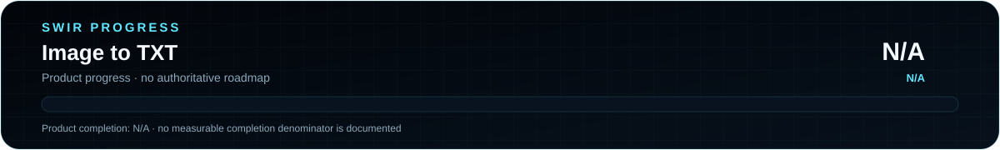

<!-- SWIR-README-STANDARD:v2 -->

<div align="center">


<br>


[](https://github.com/Swir)

</div>

# Image to TXT

Two experimental Tkinter utilities for Base64-oriented image/file conversion and preview workflows.

## 📍 Project Status

<p align="center">
  
</p>

| Item | Status |
|---|---|
| Current stage | Experimental utility |
| Interface | Tkinter |
| Public release | **Not published yet** |
| Product progress | **N/A** — no authoritative measurable roadmap exists |

## 🚀 Overview

`obraz do txt.py` loads an image with Pillow, resizes it to a selected width, converts it to RGB raw bytes and writes those bytes as Base64 text. Its current decoder reconstructs RGB data using caller-supplied dimensions; the GUI path uses default dimensions, so arbitrary images are **not guaranteed to round-trip to their original dimensions or pixels**.

`plik do txt.py` is a separate Tkinter prototype for viewing input, Base64 conversion and saving decoded data. It also previews common image formats. The code mixes text-widget and binary-file paths, so it should be treated as an experiment rather than a verified universal byte-for-byte file converter.

> **Base64 is encoding, not encryption.** It does not protect confidential data.

## ✨ Included Tools

| File | Current role |
|---|---|
| `obraz do txt.py` | Image resize → RGB bytes → Base64 text, plus a basic decoder path |
| `plik do txt.py` | General Tkinter/Base64 experiment with file loading, image preview and save actions |
| `requirements.txt` | Legacy command-style dependency note |

## ⚙️ Quick Start

```bash
git clone https://github.com/Swir/Image-to-txt.git
cd Image-to-txt
python -m pip install pillow
python "obraz do txt.py"
```

To inspect the second prototype:

```bash
python "plik do txt.py"
```

> `requirements.txt` is not a conventional pip requirements file: it contains a shell-style `pip install ...` line and names `tk`/`base64`, which are not normal PyPI dependencies for this project. Tkinter normally comes with the Python installation; `base64` is part of the Python standard library.

## 📋 Requirements / Compatibility

- Python 3.x.
- Tkinter available in the Python installation.
- Pillow (`PIL`) for image loading/preview.
- A desktop environment capable of showing Tkinter windows.

## 🎮 Usage / Workflow

For the image-oriented tool, select an image, choose the output text path and conversion width, then encode. The reverse operation reads Base64 and attempts to reconstruct RGB image bytes.

For the general prototype, choose a conversion direction, load or enter data, convert it and save the result. Validate important output independently before relying on it because the current code is experimental.

## 🧠 Technology

| Layer | Technology / role |
|---|---|
| GUI | Tkinter / ttk |
| Image processing | Pillow |
| Text representation | Python `base64` |
| File I/O | Python standard library |

## 🗺️ Roadmap / Progress

<p align="center">
  
</p>

**Product completion: N/A.** No authoritative roadmap or measurable completion denominator is present in the repository, so no readiness percentage is invented.

SVG output is deterministic and can be checked with:

```bash
python tools/generate_progress.py --check
```

## 📦 Releases

There are currently **no public GitHub Releases** for this repository.

[**GitHub Releases →**](https://github.com/Swir/Image-to-txt/releases)

## ⚠️ Limitations

- The image encoding path resizes and converts the source to RGB before Base64 encoding.
- Image dimensions are not embedded in the generated text by `obraz do txt.py`; the current GUI decoder uses default dimensions.
- The general file prototype has mixed text/binary handling and is not documented as a production-grade archival format.
- Base64 adds representation overhead and provides no encryption.

## 🔎 Search Keywords

`image to base64 python` • `tkinter base64 gui` • `image to text converter` • `python image encoder` • `pillow image base64` • `file to base64 gui` • `base64 decoder tkinter` • `binary text experiment` • `python desktop converter` • `image preview tkinter` • `rgb bytes base64` • `base64 file utility`

<div align="center">

### `ENCODE • INSPECT • VERIFY • EVOLVE`

⭐ **If this experiment is useful, consider leaving a star.**

[**← SWIR profile**](https://github.com/Swir) · [**All projects →**](https://github.com/Swir?tab=repositories)

</div>
